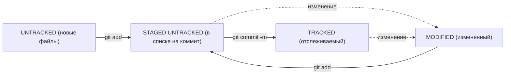

### Введение
- На английском сленге слово git означает «мерзавец». Но, по мнению Линуса Торвальдса, создателя Git, название может расшифровываться как угодно — в зависимости от настроения пользователя.
Например, Global Information Tracker (англ. «глобальный информационный трекер») — когда у вас всё хорошо и Git работает отлично. А если что-то идёт не так, Git превращается в Goddamn Idiotic Truckload of sh*t (англ. «чёртов идиотский грузовик c ...» — тут вы наверняка справитесь с переводом и без нас).
- В командной строке вы тоже всегда находитесь в какой-то папке — просто этого не видно. Узнать, где вы сейчас, поможет команда pwd (от англ. print working directory — «показать рабочую папку»). Она выводит путь к текущей директории.
- С помощью терминала вы всегда можете перейти к домашней директории. Для этого нужно ввести команду cd (от англ. change directory — «сменить директорию») и символ ~ — обозначение домашней директории. Не забудьте про Enter для выполнения.
- Когда вы открываете папку через графический интерфейс операционной системы, вы сразу видите её содержимое. В случае с консолью для отображения файлов и папок используют команду — ls (от англ. list directory contents — «отобразить содержимое директории»).
- Чтобы создать файл, нужно ввести в консоль команду touch (англ. «коснуться») с именем файла в качестве параметра: touch %ИМЯ_ФАЙЛА%.
- Для создания директорий через терминал используют другую команду — mkdir (от англ. make directory — «создать директорию»).
- Для копирования файлов через терминал существует команда cp (от англ. copy — «копировать»). В простом виде cp принимает два параметра: что копируем и куда копируем.
- Копирование создаёт копию файла или папки. Но иногда вместо копии нужно удалить файл в одном месте и создать в другом. Для этого есть команда mv (от англ. move — «переместить»). Синтаксис команды mv аналогичен синтаксису cp. После имени команды указывают список файлов и папок, которые нужно переместить, а затем — папку, в которую нужно выполнить перемещение.
- Чтобы Git начал отслеживать изменения в проекте, папку с файлами этого проекта нужно сделать Git-репозиторием (от англ. repository — «хранилище»). Для этого следует переместиться в неё и ввести команду git init (от англ. initialize — «инициализировать»).

### Хеш — идентификатор коммита
- Хеш - идентификатор коммита в Git.
- Хеширование - преобразование набора данных для получения их "отпечатка".
- Хеш коммита получается с помощью алгоритма SHA-1.
- Хеш состоит из цифр 0-9 и латинских букв A-F.
- Свойства хеша: если дважды получить хеш для одного набора данных, результат будет одинаковым.
- Если изменить хоть что-то в исходных данных, хеш изменится.
- Хеш - основной идентификатор коммита, позволяет узнать автора, дату и содержимое закоммиченных файлов.
- Хеши и таблицу хеш → информация о коммите Git сохраняет в служебных файлах в папке .git.

_Кратко: Git преобразует информацию о коммитах с помощью алгоритма SHA-1 и для каждого из них рассчитывает уникальный идентификатор — хеш.
Хеш — основной идентификатор коммита и позволяет узнать его автора, дату и содержимое закоммиченных файлов.
Все хеши, а также таблицу соответствий хеш → информация о коммите Git хранит в папке .git._

### Анализ лога
- Лог содержит описание коммита: хеш, автор, дата, сообщение.
- Сокращенный лог помогает быстро найти нужный коммит среди множества.
- Команда git log --oneline выводит сокращенный лог с хешами и комментариями.
- Уникальная длина сокращенных хешей помогает идентифицировать коммит.

_Кратко: Можно вызвать не только полный лог, но и сокращённый — это делается командой git log --oneline.
В сокращённом логе выводятся сокращённые хеши — их можно использовать точно так же, как и полные._

### Указатель HEAD
- Файл HEAD (голова, головной) указывает на последний коммит в системе git.
- Файл HEAD находится в папке .git.
- Для проверки содержимого файла HEAD можно использовать команду cat.
- Внутри файла HEAD находится ссылка на служебный файл refs/heads/master, содержащий хеш последнего коммита.
- При работе с Git указатель HEAD используется часто, его можно заменить на слово HEAD для передачи последнего коммита.

_Кратко: В числе прочих файлов в папке .git есть служебный файл HEAD. 
Он указывает на самый свежий коммит.
Вместо хеша последнего коммита можно написать слово HEAD — Git вас поймёт._

### Статусы файлов в Git
- В Git файлы могут находиться в разных состояниях: untracked, staged, modified, tracked.
- Untracked: новые файлы, не отслеживаемые Git.
- Staged: файлы после git add, в списке для коммита.
- Modified: файлы с изменениями относительно последней версии в staging.
- Tracked: файлы, отслеживаемые Git, включая фиксированные и добавленные в staging.
- Типичный жизненный цикл файла: создание, изменение, добавление в staging, коммит, изменение, добавление в staging, коммит.
- Git предоставляет больше контроля и гибкости в управлении версиями файлов.

_Кратко: Статусом untracked помечается файл, о существовании которого Git знает, но не следит за изменениями в нём. 
Этот статус — противоположность tracked, в который попадают все файлы, отслеживаемые Git.
Файл переходит в статус staged после выполнения git add.
Статус modified означает, что файл был изменён.
Большинство файлов в проектах «шагает» по следующему циклу: «изменён» → «добавлен в список на коммит» → «закоммичен» → «изменён» → и так далее._

### Как читать git status
- Типичные варианты вывода git status: без изменений, с найденными неотслеживаемыми файлами, с изменениями, которые не войдут в коммит, и с изменениями, которые уже попали в коммит.
- В случае изменений файла, git status может показать его состояние как "staged" и "modified".

_Кратко: Команда git status всегда подскажет, что происходит с файлом: например, он добавлен в список «на коммит» или ещё вообще не отслеживается, или изменён.
git status показывает явно следующие состояния файлов: untracked, staged и modified.
git status подсказывает, какие команды можно выполнить, чтобы поменять состояние файла._

### Оформление сообщений к коммитам
- Оформление сообщений к коммитам в Git может подчиняться определённым правилам, которые могут быть продиктованы 
культурой команды или техническими ограничениями.
- В выводе команды git log --oneline умещается максимум 72 первых символа сообщения, поэтому многие правила 
включают пункт: «Сообщение не должно быть длиннее 72 символов».
- Все люди разные и у всех есть предпочтения - в том числе, как формулировать сообщения коммитов. 
Но без единообразия коммитов нет и эффективной работы в Git.
- В корпоративном стиле в начале сообщения обычно указывают Jira-ID, а после - текст сообщения.
- Conventional Commits предлагает такой формат коммита: <type>: <сообщение>.
- Для сообщений на русском языке часто рекомендуют использовать инфинитивы, а для сообщений на английском 
рекомендуется использовать повелительное наклонение

_Кратко: Правильно описывать коммиты — искусство, к которому стоит приобщиться как можно раньше. Хорошо, когда:
сообщение коммита легко читается; оно информативное; все сообщения оформлены в одном стиле._

### Как откатиться назад, если «всё сломалось
- Команда git restore --staged <file> переведёт файл из staged обратно в modified или untracked.
- Команда git reset --hard <commit hash> «откатит» историю до коммита с хешем <hash>. Более поздние коммиты потеряются!
- Команда git restore <file> «откатит» изменения в файле до последней сохранённой (в коммите или в staging) версии.

### Просматриваем изменения в файлах
- Команда git diff используется для просмотра изменений в файлах после коммита.
- Она сравнивает последнюю закоммированную версию файла с текущей (изменённой) версией.
- Вывод git diff содержит информацию о том, какие строки были удалены, добавлены или сохранены.
- Флаг --staged позволяет просматривать изменения в staged-файлах.
- Git diff и git diff --staged полезны для просмотра изменений в файлах.
_Кратко: Команда git diff сравнит последнюю закоммиченную версию файла с той, что находится в состоянии modified.
Команда git diff --staged покажет изменения в staged-файлах относительно последних закоммиченных версий._

### Сопоставляем коммиты
- Команда echo выводит в консоль то, что ей передали в качестве параметра, но если скомбинировать echo 
с символами перенаправления вывода >>, то всё, что должно было попасть на экран, вместо этого будет записано в файл.
- Оператор >> - это возможность командной строки (Bash), его можно использовать не только с echo, но и с любой другой командой, 
которая выводит что-то на экран.
- Одинарный символ > тоже перенаправит вывод команды в файл, но перед этим сотрёт содержимое файла, то есть перезапишет файл целиком.
_Кратко: На этом всё про git diff! Эта команда поможет узнать, какие строки и в каких файлах изменились. 
Может быть полезно при поиске ошибок или чтобы разобраться, откуда появилась та или иная строка. 
В этом уроке вы также познакомились с командой git diff <коммит1> <коммит2>. С её помощью удобно сравнивать изменения в двух коммитах._

### Игнорирование файлов в Git
- Если нужно, чтобы Git игнорировал какие-то файлы, стоит составить файл .gitignore.
- Посмотреть, что игнорируется, можно с помощью команды git status --ignored.
- Сам файл .gitignore — это обычный файл в репозитории. Его тоже стоит закоммитить.
- Шаблонов много, но их легко найти в интернете вместе с примерами использования.

### Выполняем Fork
- Fork (fork) - операция на GitHub, которая создает копию репозитория в аккаунте пользователя.
- Fork используется для внесения вклада в проект, развития проекта независимо от исходного или создания своего проекта на основе чужого.
- Для выполнения Fork необходимо перейти на сайт GitHub, нажать на кнопку Fork в правом верхнем углу и создать копию репозитория.
- После создания копии можно вносить изменения и отправлять их в удаленный репозиторий.
- Fork может быть использован для клонирования репозитория на локальный компьютер.
- Fork позволяет получить точную копию репозитория, которая полностью независима от исходного проекта.
_Кратко:«Форк» позволяет получить точную копию GitHub-репозитория в ваш аккаунт.
Копия, которая получена с помощью «форка», полностью независима от оригинального проекта — изменения не будут синхронизированы._

### Что такое ветка
- Ветка - это изолированный поток разработки проекта, который позволяет экспериментировать с проектом и сохранять репозиторий в стабильном состоянии.
- Ветки полезны, даже если вы работаете в одиночку, например, над сайтом.
- Основная, стабильная версия проекта хранится в главной ветке main или master.
- Ветки помогают декомпозировать большую и страшную задачу на маленькие и понятные.
_Кратко: Ветка — это последовательность независимых изменений.
Благодаря веткам несколько человек могут работать над одним репозиторием и не мешать друг другу. А ещё ветки помогают декомпозировать большую и страшную задачу на маленькие и понятные.
Основная версия проекта хранится в главной ветке main (или master).
С помощью команды git branch можно посмотреть, какие в проекте есть ветки и в какой из них вы сейчас находитесь._

### Создаём ветку
- Ветки в Git позволяют экспериментировать с проектом и разделять крупные задачи на мелкие.
- Создание ветки в Git осуществляется командой git branch <название_ветки>.
- Название ветки может состоять из букв, цифр и специальных символов, но не образуют иерархию.
- Ветки могут быть названы feature/add-branch-info или feature_add-branch-info.
- Ветки должны быть названы так, чтобы другим участникам было понятно, что в них происходит.
- Ветки могут содержать сколько угодно коммитов, а после завершения работы нужно объединить их.

### Шагаем с ветки на ветку
- Команда git checkout <название_ветки> позволяет переключаться на другую ветку.
- Разные ветки в одном проекте существуют независимо. Изменения в одной не влияют на изменения в другой.
- В Git можно создать ветку и сразу же перейти в неё командой git checkout -b <название_ветки>.
- Ветка указывает на коммит, который сделан в ней последним. При этом две ветки могут ссылаться на один и тот же коммит — например, если вы только что создали ветку, но ещё не успели внести в неё коммит.
- Посмотреть и локальные, и удалённые ветки можно с помощью команды git branch -a.

### Сравниваем ветки
- Команда git diff используется для сравнения коммитов, modified- и staged-файлов.
- Ветки в Git: команда git branch без аргументов показывает активные ветки в проекте.
- Сравнение веток: команда git diff <названиеветки1> <названиеветки2> для сравнения веток.
- Суффикс навигации ~N: используется для сравнения хешей коммитов, начиная с заданного коммита N назад во времени.
- Примеры использования: git diff HEAD~1, git diff feature/diff~1, git diff 2ea56ab~.
_Кратко: git diff может сравнивать ветки по их названиям. Например, команда git diff main feature/my-feature выведет разницу между основной веткой и веткой feature/my-feature.
Git поддерживает суффикс навигации ~. С его помощью можно сослаться на предыдущие коммиты. Например, если вы находитесь в ветке main и хотите вывести разницу между тем коммитом, который был три коммита назад, и текущим, нужно выполнить git diff main~3 main._

### Объединяем и удаляем ветки
- Слияние веток - объединение изменений из отдельной ветки с главной веткой проекта.
- Для слияния веток используется команда git merge <название_ветки>.
- Перед началом процесса слияния необходимо перейти в главную ветку.
- Fast-forward - режим слияния, при котором итогом слияния будет линейная история коммитов.
- После слияния веток, репозиторий перейдет в новое состояние.
- Основная ветка и ветка-донор указывают на один коммит.
- Удаление ветки после слияния выполняется командой git branch -D <название_ветки>.
- Удаление локальной ветки через Git не удаляет ветку на GitHub.
_Кратко: Выполнить слияние веток позволяет команда git merge <название_ветки>. В качестве параметра указывают название ветки, которую нужно влить в текущую.
Удалять ненужные ветки после слияния — хорошая практика. Так в вашем репозитории всегда будет порядок. За удаление веток отвечает команда git branch -D <название_ветки> и её щадящий вариант с флагом -d._

### Создаём pull request
- Пул-реквест — это запрос на рассмотрение предлагаемых изменений и часть процесса ревью.
- Запрос на изменения можно инициировать двумя способами: через ссылку, которую Git выводит после создания ветки, или через интерфейс GitHub.
- После создания пул-реквеста ваши коллеги сделают ревью — оценят предложенные вами правки и оставят свои комментарии.
- По результатам ревью ваши правки могут быть приняты в основную ветку проекта или возвращены на доработку.

### Забираем изменения из удалённого репозитория
- Команда git pull позволяет подтянуть изменения из удалённого репозитория в локальный.
- Перед созданием нового пул-реквеста считается хорошей практикой перейти в главную ветку, «подтянуть» в неё изменения, а затем добавить эти изменения в вашу ветку с помощью git merge main.

### Что такое fast-forward
- Отключение fast-forward приводит к созданию merge-коммитов, которые сохраняют всю информацию о слиянии веток.
- Fast-forward слияния веток может привести к потере информации, поэтому многие проекты его отключают.
- Если истории двух веток не «разошлись» и их коммиты выстраиваются в одну цепочку, эти ветки можно объединить в режиме fast-forward.
- Режим fast-forward можно отключить с помощью флага --no-ff.

### Non-fast-forward
- Если истории двух веток всё же «разошлись», при слиянии веток Git создаст коммит слияния.
- При объединении веток в состоянии не-fast-forward возможны (но не обязательны) конфликты. Если конфликты всё же возникли, Git попытается разрешить их самостоятельно или попросит вас сделать это вручную.
- Чаще всего сообщения к коммитам слияния не редактируют и оставляют «как предложил Git». Для таких случаев удобен флаг --no-edit: git merge --no-edit %another_branch%.

### Модели веток. Простая feature branch модель
- Подходы к работе с ветками описывают правила создания и слияния коммитов.
- Feature branch workflow - самый простой и популярный подход, где для каждого нового изменения создается новая ветка.
- Git flow - более сложный подход, где создаётся больше веток и коммиты делятся на разные типы.
- Trunk-based подход популярен в больших компаниях, где участники проекта вливают свой код в основную ветку максимально часто.
- Feature branch workflow позволяет разработчикам трудиться над новыми функциональностями или исправлениями независимо друг от друга.
- В ветке main всегда рабочая версия проекта, а все "полуфабрикаты" и недоделанные функциональности находятся в feature-ветках.
- Feature branch workflow - это шаблон, который можно подстраивать под свои нужды, но ключевая особенность - одна основная ветка и много feature-веток.
- Разные компании и команды используют разные модели работы с Git, но все они основаны на создании новых веток для каждой новой функциональности или исправления.
_Кратко: Разные компании и команды используют разные модели работы с Git. Эти модели описывают структуру веток в проекте, а также правила создания и слияния коммитов в них.
Один из самых простых и популярных подходов — feature branch workflow. Он предполагает, что работа над функциональностью ведётся в отдельной feature-ветке. Когда всё готово, эта ветка вливается в основную.
Подход feature branch workflow — лишь шаблон, по которому можно действовать. Многие компании и команды меняют его под свои нужды, но неизменно одно: хочешь сделать новую функциональность или исправить баг — создай новую ветку!_

### Pull request и code review
- Feature Branch Workflow: новая функциональность разрабатывается в feature-ветках, которые затем вливаются в main.
- Перед вливанием в main, feature-ветки проходят проверки, включая code review.
- Пул-реквест (или мёрж-реквест) - запрос на слияние feature-ветки в main.
- В некоторых командах строго следят за качеством изменений, в других - проще относятся к тому, что попадает в основную ветку.
- На этапе пул-реквеста возможны автоматические тесты и code review.
- Code review выполняет две функции: проверка качества и необходимости предлагаемых изменений, а также получение информации о новых изменениях в проекте.
- В процессе ревью можно обсуждать предлагаемые изменения и задавать вопросы.
- После одобрения пул-реквеста, автор может нажать кнопку Merge, чтобы влить feature-ветку в main.

### Разрешение конфликта вручную и через vimdiff
- Конфликты в Git возникают, когда разные ветки изменяют один и тот же файл в разных местах.
- Git не может сам решить, какая версия файла "правильная", поэтому необходимо разрешить конфликты вручную или через инструмент слияния vimdiff.
- Для разрешения конфликта вручную нужно открыть файл и удалить маркеры конфликтов, оставив только нужные изменения.
- Для разрешения конфликта через vimdiff нужно вызвать команду git mergetool, после чего открыть vimdiff и разрешить конфликт, удалив маркеры и оставив нужные изменения.
- Vimdiff - это инструмент слияния, доступный по умолчанию в Git.
_Кратко: Конфликты — это ситуация, в которой две ветки или более изменяют один и тот же файл в разных местах и пытаются объединиться в одну ветку.
При возникновении конфликта Git добавит в файлы маркеры конфликтов. Вы можете разрешить конфликт вручную: достаточно удалить маркеры и принять правильные изменения.
Для разрешения конфликтов вы также можете использовать vimdiff — он доступен по умолчанию._