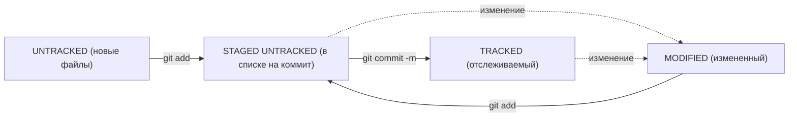

### Введение
- На английском сленге слово git означает «мерзавец». Но, по мнению Линуса Торвальдса, создателя Git, название может расшифровываться как угодно — в зависимости от настроения пользователя.
Например, Global Information Tracker (англ. «глобальный информационный трекер») — когда у вас всё хорошо и Git работает отлично. А если что-то идёт не так, Git превращается в Goddamn Idiotic Truckload of sh*t (англ. «чёртов идиотский грузовик c ...» — тут вы наверняка справитесь с переводом и без нас).
- В командной строке вы тоже всегда находитесь в какой-то папке — просто этого не видно. Узнать, где вы сейчас, поможет команда pwd (от англ. print working directory — «показать рабочую папку»). Она выводит путь к текущей директории.
- С помощью терминала вы всегда можете перейти к домашней директории. Для этого нужно ввести команду cd (от англ. change directory — «сменить директорию») и символ ~ — обозначение домашней директории. Не забудьте про Enter для выполнения.
- Когда вы открываете папку через графический интерфейс операционной системы, вы сразу видите её содержимое. В случае с консолью для отображения файлов и папок используют команду — ls (от англ. list directory contents — «отобразить содержимое директории»).
- Чтобы создать файл, нужно ввести в консоль команду touch (англ. «коснуться») с именем файла в качестве параметра: touch %ИМЯ_ФАЙЛА%.
- Для создания директорий через терминал используют другую команду — mkdir (от англ. make directory — «создать директорию»).
- Для копирования файлов через терминал существует команда cp (от англ. copy — «копировать»). В простом виде cp принимает два параметра: что копируем и куда копируем.
- Копирование создаёт копию файла или папки. Но иногда вместо копии нужно удалить файл в одном месте и создать в другом. Для этого есть команда mv (от англ. move — «переместить»). Синтаксис команды mv аналогичен синтаксису cp. После имени команды указывают список файлов и папок, которые нужно переместить, а затем — папку, в которую нужно выполнить перемещение.
- Чтобы Git начал отслеживать изменения в проекте, папку с файлами этого проекта нужно сделать Git-репозиторием (от англ. repository — «хранилище»). Для этого следует переместиться в неё и ввести команду git init (от англ. initialize — «инициализировать»).

### Хеш — идентификатор коммита
- Хеш - идентификатор коммита в Git.
- Хеширование - преобразование набора данных для получения их "отпечатка".
- Хеш коммита получается с помощью алгоритма SHA-1.
- Хеш состоит из цифр 0-9 и латинских букв A-F.
- Свойства хеша: если дважды получить хеш для одного набора данных, результат будет одинаковым.
- Если изменить хоть что-то в исходных данных, хеш изменится.
- Хеш - основной идентификатор коммита, позволяет узнать автора, дату и содержимое закоммиченных файлов.
- Хеши и таблицу хеш → информация о коммите Git сохраняет в служебных файлах в папке .git.

_Кратко: Git преобразует информацию о коммитах с помощью алгоритма SHA-1 и для каждого из них рассчитывает уникальный идентификатор — хеш.
Хеш — основной идентификатор коммита и позволяет узнать его автора, дату и содержимое закоммиченных файлов.
Все хеши, а также таблицу соответствий хеш → информация о коммите Git хранит в папке .git._

### Анализ лога
- Лог содержит описание коммита: хеш, автор, дата, сообщение.
- Сокращенный лог помогает быстро найти нужный коммит среди множества.
- Команда git log --oneline выводит сокращенный лог с хешами и комментариями.
- Уникальная длина сокращенных хешей помогает идентифицировать коммит.

_Кратко: Можно вызвать не только полный лог, но и сокращённый — это делается командой git log --oneline.
В сокращённом логе выводятся сокращённые хеши — их можно использовать точно так же, как и полные._

### Указатель HEAD
- Файл HEAD (голова, головной) указывает на последний коммит в системе git.
- Файл HEAD находится в папке .git.
- Для проверки содержимого файла HEAD можно использовать команду cat.
- Внутри файла HEAD находится ссылка на служебный файл refs/heads/master, содержащий хеш последнего коммита.
- При работе с Git указатель HEAD используется часто, его можно заменить на слово HEAD для передачи последнего коммита.

_Кратко: В числе прочих файлов в папке .git есть служебный файл HEAD. 
Он указывает на самый свежий коммит.
Вместо хеша последнего коммита можно написать слово HEAD — Git вас поймёт._

### Статусы файлов в Git
- В Git файлы могут находиться в разных состояниях: untracked, staged, modified, tracked.
- Untracked: новые файлы, не отслеживаемые Git.
- Staged: файлы после git add, в списке для коммита.
- Modified: файлы с изменениями относительно последней версии в staging.
- Tracked: файлы, отслеживаемые Git, включая фиксированные и добавленные в staging.
- Типичный жизненный цикл файла: создание, изменение, добавление в staging, коммит, изменение, добавление в staging, коммит.
- Git предоставляет больше контроля и гибкости в управлении версиями файлов.

_Кратко: Статусом untracked помечается файл, о существовании которого Git знает, но не следит за изменениями в нём. 
Этот статус — противоположность tracked, в который попадают все файлы, отслеживаемые Git.
Файл переходит в статус staged после выполнения git add.
Статус modified означает, что файл был изменён.
Большинство файлов в проектах «шагает» по следующему циклу: «изменён» → «добавлен в список на коммит» → «закоммичен» → «изменён» → и так далее._

### Как читать git status
- Типичные варианты вывода git status: без изменений, с найденными неотслеживаемыми файлами, с изменениями, которые не войдут в коммит, и с изменениями, которые уже попали в коммит.
- В случае изменений файла, git status может показать его состояние как "staged" и "modified".

_Кратко: Команда git status всегда подскажет, что происходит с файлом: например, он добавлен в список «на коммит» или ещё вообще не отслеживается, или изменён.
git status показывает явно следующие состояния файлов: untracked, staged и modified.
git status подсказывает, какие команды можно выполнить, чтобы поменять состояние файла._

### Оформление сообщений к коммитам
- Оформление сообщений к коммитам в Git может подчиняться определённым правилам, которые могут быть продиктованы 
культурой команды или техническими ограничениями.
- В выводе команды git log --oneline умещается максимум 72 первых символа сообщения, поэтому многие правила 
включают пункт: «Сообщение не должно быть длиннее 72 символов».
- Все люди разные и у всех есть предпочтения - в том числе, как формулировать сообщения коммитов. 
Но без единообразия коммитов нет и эффективной работы в Git.
- В корпоративном стиле в начале сообщения обычно указывают Jira-ID, а после - текст сообщения.
- Conventional Commits предлагает такой формат коммита: <type>: <сообщение>.
- Для сообщений на русском языке часто рекомендуют использовать инфинитивы, а для сообщений на английском 
рекомендуется использовать повелительное наклонение

_Кратко: Правильно описывать коммиты — искусство, к которому стоит приобщиться как можно раньше. Хорошо, когда:
сообщение коммита легко читается; оно информативное; все сообщения оформлены в одном стиле._

---